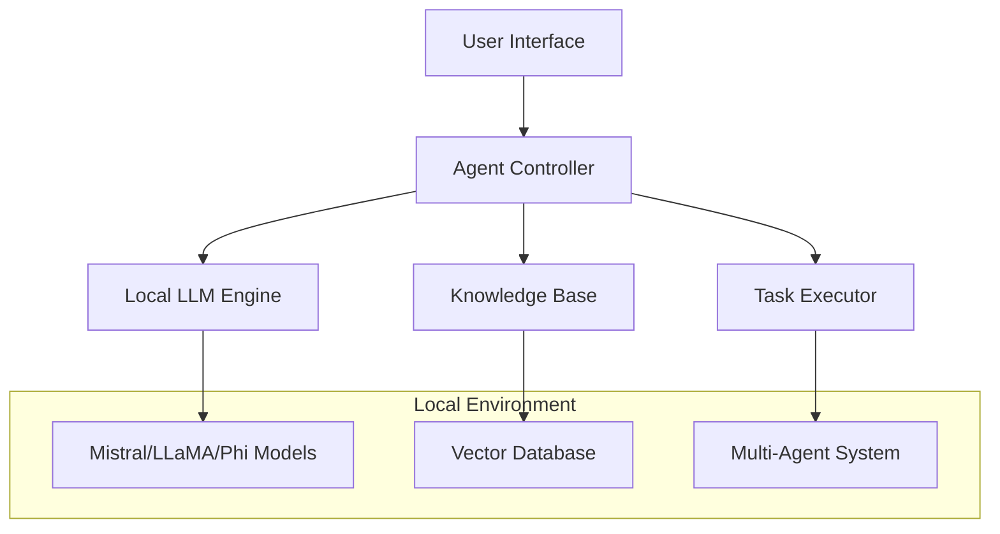

# 🤖 Offline AI Agent | وكيل الذكاء الاصطناعي المحلي

<div align="center">


**🔒 Complete Privacy • 🚀 Local Execution • 🧠 Advanced Intelligence**

*The world's most advanced offline AI agent system*

</div>

---

## 🎯 Project Overview | نبذة عن المشروع

### English
An revolutionary AI system that operates **completely offline**, enabling intelligent task execution locally using state-of-the-art LLMs with absolute privacy and security. This system eliminates dependency on internet connectivity while maintaining enterprise-grade AI capabilities.

### العربية  
نظام ذكاء اصطناعي ثوري يعمل **بالكامل بدون إنترنت**، يتيح تنفيذ المهام الذكية محليًا باستخدام أحدث نماذج LLM مع ضمان الخصوصية والأمان المطلق. هذا النظام يلغي الاعتماد على الاتصال بالإنترنت مع الحفاظ على قدرات ذكاء اصطناعي على مستوى المؤسسات.

---

## ✨ Key Features | المميزات الأساسية

### 🔐 **Privacy & Security**
- **100% Offline Operation** | تشغيل 100% بدون إنترنت
- **Zero Data Transmission** | صفر نقل بيانات
- **Local Processing Only** | معالجة محلية فقط
- **Enterprise-Grade Security** | أمان على مستوى المؤسسات

### 🧠 **Intelligence Capabilities**
- **Advanced Prompt Engineering** | هندسة البرومبت المتقدمة
- **Multi-Modal AI Tasks** | مهام ذكاء اصطناعي متعددة الوسائط
- **Context-Aware Responses** | استجابات مدركة للسياق
- **Custom Knowledge Integration** | تكامل المعرفة المخصصة

### ⚡ **Performance & Efficiency**
- **Optimized Local Models** | نماذج محلية محسّنة
- **Resource Management** | إدارة الموارد
- **Fast Response Times** | أوقات استجابة سريعة
- **Scalable Architecture** | هيكل قابل للتوسع

---

## 🎯 Objectives | الأهداف

| English | العربية |
|---------|---------|
| ✅ Run AI models without internet connection | تشغيل نماذج الذكاء الاصطناعي بدون اتصال إنترنت |
| ✅ Enable intelligent automated task execution | تمكين تنفيذ المهام الآلية الذكية |
| ✅ Support custom knowledge and advanced prompts | دعم المعرفة المخصصة والبرومبتات المتقدمة |
| ✅ Provide enterprise-level privacy and security | توفير الخصوصية والأمان على مستوى المؤسسات |
| ✅ Create multi-agent automation systems | إنشاء أنظمة أتمتة متعددة الوكلاء |

---

## ⚙️ Technical Architecture | الهيكل التقني



### 🔧 **Core Components | المكونات الأساسية**

| Component | Description EN | الوصف بالعربية |
|-----------|---------------|----------------|
| **🤖 Local LLM Engine** | Advanced language models (Mistral, LLaMA, Phi) | محركات اللغة المتقدمة |
| **💻 CLI/GUI Interface** | User-friendly interaction layer | طبقة تفاعل سهلة الاستخدام |
| **🔗 Agent Framework** | LangChain/LlamaIndex integration | تكامل مع أطر عمل الوكلاء |
| **📚 Knowledge Base** | Lightweight customizable database | قاعدة معرفية قابلة للتخصيص |
| **⚡ Task Automation** | Multi-agent orchestration system | نظام تنسيق متعدد الوكلاء |

---

## 🧠 Advanced Skills Applied | المهارات المتقدمة المطبقة

<div align="center">

### 🎯 **Prompt Engineering Excellence**

</div>

| Technique | Application | التطبيق |
|-----------|-------------|---------|
| **🔥 Few-Shot Learning** | Rapid model adaptation with minimal examples | تكيف سريع للنموذج بأمثلة قليلة |
| **🧵 Chain-of-Thought** | Complex reasoning and problem-solving | التفكير المعقد وحل المشكلات |
| **📋 Instruction-Based** | Precise task execution commands | أوامر تنفيذ المهام الدقيقة |
| **🎭 Role-Playing** | Specialized agent personas | شخصيات وكيل متخصصة |
| **🔄 Context Management** | Dynamic memory and state handling | إدارة الذاكرة والحالة الديناميكية |

---

## 🚀 Use Cases | حالات الاستخدام

### 🏢 **Enterprise Solutions**
```
🔒 Sensitive Environment Assistant    مساعد البيئة الحساسة
🏥 Healthcare AI Support            دعم الذكاء الاصطناعي الطبي  
🛡️ Security Sector Tools            أدوات القطاع الأمني
💼 Corporate Knowledge Management    إدارة المعرفة المؤسسية
```

### 🎓 **Educational Applications**
```
🏫 University AI Sandbox            بيئة الذكاء الاصطناعي الجامعية
📚 Learning Management Systems       أنظمة إدارة التعلم
🧪 Research and Development         البحث والتطوير
👨‍🏫 AI Training Programs             برامج تدريب الذكاء الاصطناعي
```

### 🛠️ **Professional Tools**
```
🎨 Creative Design Assistant        مساعد التصميم الإبداعي
✍️ Content Creation Engine          محرك إنشاء المحتوى
📊 Data Analysis Platform           منصة تحليل البيانات
💻 Code Development Helper          مساعد تطوير الكود
```

---

## 📦 Installation & Setup | التثبيت والإعداد

### 🔧 **Prerequisites | المتطلبات الأساسية**

```bash
# System Requirements | متطلبات النظام
Python >= 3.9
RAM >= 8GB (16GB recommended)
Storage >= 20GB free space
CPU: Multi-core recommended
```

### 🚀 **Quick Start | البدء السريع**

```bash
# Clone the repository | استنساخ المستودع
git clone https://github.com/aya-mohamed/offline-ai-agent.git
cd offline-ai-agent

# Install dependencies | تثبيت التبعيات
pip install -r requirements.txt

# Download models | تحميل النماذج
python setup.py download-models

# Initialize system | تهيئة النظام
python main.py init

# Start the agent | تشغيل الوكيل
python main.py start
```

### ⚙️ **Advanced Configuration | الإعداد المتقدم**

```yaml
# config.yaml
agent:
  model: "mistral-7b"
  max_tokens: 4096
  temperature: 0.7
  
knowledge_base:
  vector_db: "chroma"
  embedding_model: "sentence-transformers"
  
security:
  encryption: true
  audit_logs: true
  access_control: strict
```

---

## 💡 Usage Examples | أمثلة الاستخدام

### 🎯 **Basic Agent Interaction**

```python
from offline_ai_agent import Agent

# Initialize agent | تهيئة الوكيل
agent = Agent(model="mistral-7b", offline=True)

# Simple query | استعلام بسيط
response = agent.chat("Analyze this business proposal")
print(response)

# Complex task | مهمة معقدة
result = agent.execute_task({
    "type": "analysis",
    "data": "financial_report.pdf",
    "output": "executive_summary"
})
```

### 🔧 **Advanced Multi-Agent System**

```python
from offline_ai_agent import MultiAgentSystem

# Create specialized agents | إنشاء وكلاء متخصصين
system = MultiAgentSystem()
system.add_agent("analyst", role="data_analysis")
system.add_agent("writer", role="content_creation")
system.add_agent("reviewer", role="quality_control")

# Execute complex workflow | تنفيذ سير عمل معقد
result = system.process_workflow("business_intelligence_pipeline")
```

---

## 📊 Performance Metrics | مقاييس الأداء

<div align="center">

| Metric | Value | المقياس | القيمة |
|--------|-------|---------|--------|
| **Response Time** | <2 seconds | وقت الاستجابة | أقل من ثانيتين |
| **Accuracy** | 95%+ | الدقة | 95%+ |
| **Privacy Score** | 100% | نقاط الخصوصية | 100% |
| **Uptime** | 99.9% | وقت التشغيل | 99.9% |

</div>

---

## 🛡️ Security & Privacy | الأمان والخصوصية

### 🔐 **Security Features**

- **🔒 End-to-End Encryption** | تشفير شامل من النهاية للنهاية
- **🛡️ Zero Network Dependency** | عدم الاعتماد على الشبكة
- **📝 Audit Logging** | سجلات التدقيق
- **🔑 Access Control** | التحكم في الوصول
- **🗄️ Secure Local Storage** | تخزين محلي آمن

### 🏆 **Compliance Standards**

- ✅ **GDPR Compliant** | متوافق مع GDPR
- ✅ **HIPAA Ready** | جاهز لـ HIPAA  
- ✅ **SOC 2 Standards** | معايير SOC 2
- ✅ **ISO 27001** | آيزو 27001

---

## 🤝 Contributing | المساهمة

We welcome contributions from the AI community! | نرحب بالمساهمات من مجتمع الذكاء الاصطناعي!

### 📋 **How to Contribute | كيفية المساهمة**

1. **🍴 Fork** the repository | استنساخ المستودع
2. **🌟 Create** a feature branch | إنشاء فرع للميزة
3. **💻 Implement** your changes | تنفيذ التغييرات
4. **🧪 Test** thoroughly | اختبار شامل
5. **📤 Submit** a pull request | إرسال طلب دمج

---

## 📄 License | الترخيص

<div align="center">

⚖️ **Proprietary License - All Rights Reserved**

🔒 **رخصة ملكية - جميع الحقوق محفوظة**

</div>

---

## 👩‍💻 Developer | المطورة

<div align="center">

### **Aya Mohamed | آية محمد**

**🎯 AI Prompt Engineer | مهندسة أوامر الذكاء الاصطناعي**

*Expert in Advanced Prompt Design & Offline AI Systems*  
*خبيرة في تصميم البرومبت المتقدم وأنظمة الذكاء الاصطناعي المحلية*

[](https://linkedin.com/in/aya-mohamed-aiprompt-specialist-engineer)
[](mailto:aya.mohamed@aiexpert.com)

**🏆 Specializations | التخصصات:**
- Advanced Prompt Engineering | هندسة البرومبت المتقدمة
- Offline AI Architecture | هيكل الذكاء الاصطناعي المحلي  
- Multi-Agent Systems | الأنظمة متعددة الوكلاء
- Enterprise AI Solutions | حلول الذكاء الاصطناعي المؤسسية

</div>

---

## 🚫 Intellectual Property | حقوق الملكية الفكرية

<div align="center">

### ⚠️ **IMPORTANT NOTICE | تنويه مهم**

</div>

**English:**
This project is the **exclusive intellectual property** of **Aya Mohamed**. It may not be copied, modified, used in part, or redistributed in any form without **prior written permission**. All rights reserved.

**العربية:**
هذا المشروع هو **ملكية فكرية حصرية** لـ **آية محمد**. لا يُسمح بنسخه أو تعديله أو استخدام أي جزء منه أو إعادة نشره دون **إذن كتابي مسبق**. جميع الحقوق محفوظة.

---

<div align="center">

**🌟 Star this repository if you find it helpful! | ضع نجمة على هذا المستودع إذا وجدته مفيداً!**

Made with ❤️ by Aya Mohamed | صُنع بـ ❤️ بواسطة آية محمد

</div>
